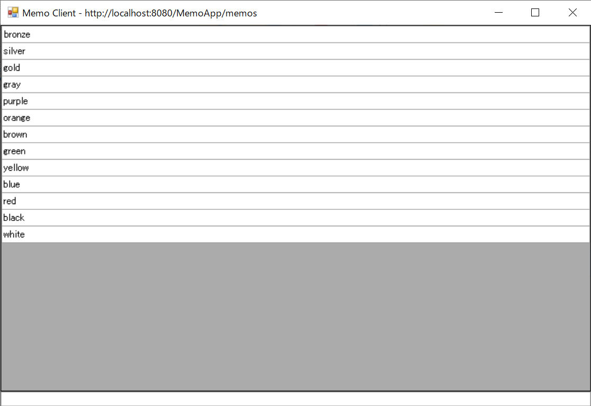
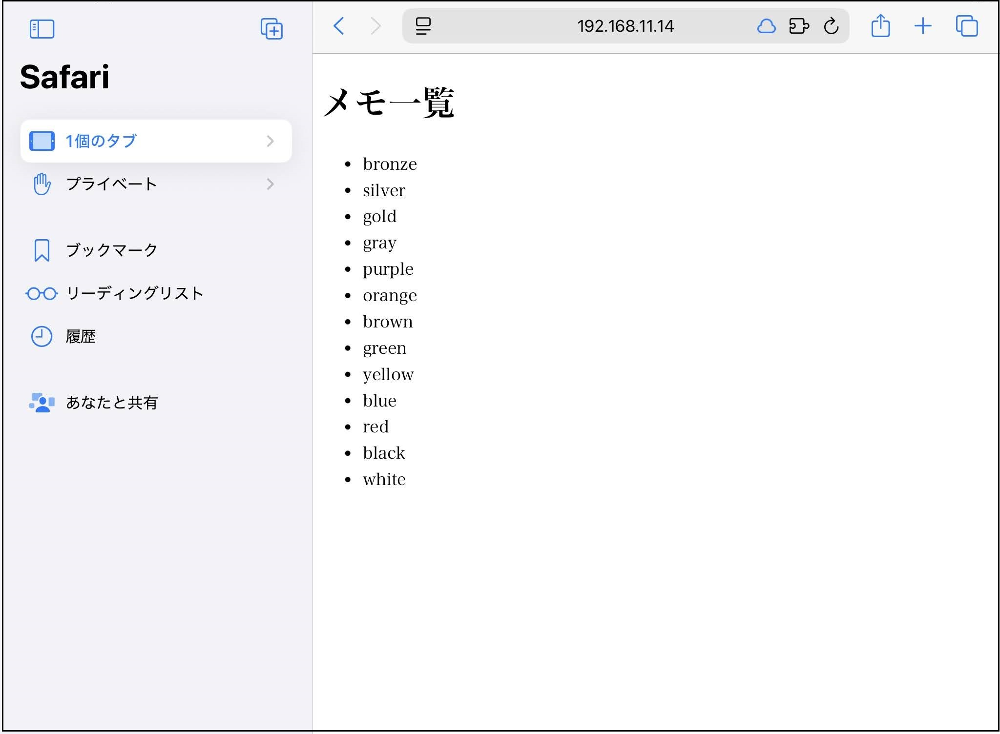
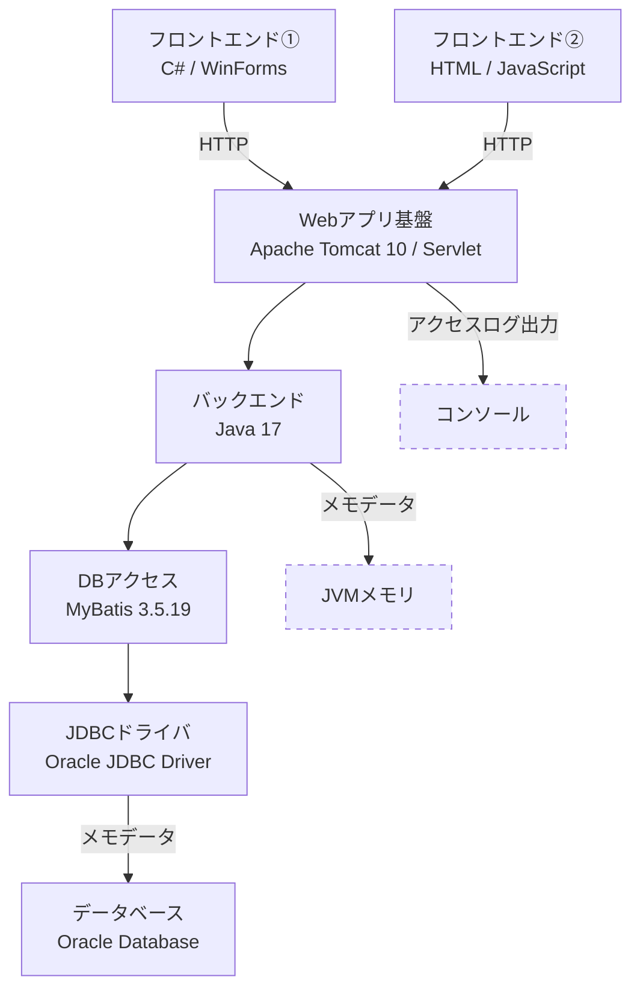

# MemoApp

## 概要
C#画面のメモアプリです。メモはJavaサーバーを経由してOracle Databaseへ保存されます。保存されたメモは他の端末のブラウザから閲覧できます。
金融系システム開発での経験を再現しながら、「フロントエンド─バックエンド─DB」連携の理解を深めることを目的として作りました。

## Ver.2で追加した内容
- HttpServer（標準ライブラリ）からServlet（Apache Tomcat）へ移行しました。
- コンソール画面でアクセスログを確認できるようにしました。
- 同一LAN内の端末（スマートフォンやタブレットを含む）のブラウザからメモの一覧を表示できるようにしました。
- Oracle Database環境が無い場合でも起動するようにしました。

## 画面
- フロントエンド①


- フロントエンド②


## 使用技術
| 分類      　　　 | 技術                       | 用途                           |
| ---------------- | -------------------------- | ------------------------------ |
| フロントエンド① | C# / WinForms              | Windows用メモ編集 　　　　　　 |
| フロントエンド② | HTML / JavaScript          | ブラウザ用メモ一覧 　　　　　　|
| Webアプリ基盤  　| Apache Tomcat 10 / Servlet | HTTPリクエストの受付           |
| バックエンド   　| Java 17                    | サーバー側処理の実装           |
| DBアクセス     　| MyBatis 3.5.19             | JavaとSQLの連携                |
| JDBCドライバ   　| Oracle JDBC Driver　　　　 | JavaからOracle Databaseへ接続  |
| データベース   　| Oracle Database            | メモの保存                     |

## 構成



- 【フロントエンド①】Windows上のC#クライアントで操作します。ServletへHTTPリクエスト（メモの取得・追加・更新・削除）を送信しています。
  接続先は`api-url.txt` から読み込まれます。
- 【フロントエンド②】Windows以外の端末でもブラウザを利用してメモを閲覧できます。HTML画面内のJavaScriptでServletへHTTPリクエスト（メモ取得）を送信しています。
- 【Webアプリ基盤】Apache Tomcat 10上でServletとしてHTTPリクエストを受け付けます。その際のアクセスログをコンソール画面で確認できます。
- 【バックエンド】Javaは、Tomcat上で動作するサーバー側処理として、HTTPリクエストの内容に応じてメモの取得・追加・更新・削除を行います。  保存先はポリモーフィズムを利用した設計（MemoRepositoryインターフェース）で切り替え、通常はMyBatis経由でOracle Databaseへ保存し（MyBatisMemoRepositoryクラス）、DB接続不可時はJVMメモリ上に保存します（InMemoryMemoRepositoryクラス）。
- 【DBアクセス】MyBatis 3.5.19を通してJavaからDBへ接続情報やSQLを送ります。
  接続情報は「mybatis-config.xml」から読み込まれます。
  SQLは「MemoMapper.xml」から動的に読み込まれます。
- 【JDBCドライバ】Oracle JDBC Driverを通してサーバーはデータベースに接続されます。
- 【データベース】Oracle Databaseを利用します。「memos」テーブルへメモデータが保存されます。

## 基本操作
	下段入力欄で Enter
	  入力した内容を新しいメモとして追加します。
	上段メモ一覧で ダブルクリック
	  選択中のメモに対して、編集を行えます。
	上段メモ一覧で 右クリック
	  選択中のメモに対して、編集・コピー・削除を行えます。

## ショートカットキー
	Insert
	  下段入力欄へフォーカスを移動します。
	Esc
	  上段のメモ一覧へフォーカスを戻します。
	Ctrl + C（又はCtrl + Insert）
	  選択中のメモ内容をコピーします。
	Ctrl + V（又はShift + Insert）
	  クリップボードの内容を新しいメモとして追加します。
	F2
	  選択中のメモを編集します。
	Delete
	  選択中のメモを削除します。

## ディレクトリ構成
```text
MemoApp
├─ README.md
├─ src
│  └─ app
│      └─ Javaソース一式
├─ resources
│  ├─ MemoMapper.xml
│  ├─ mybatis-config.example.xml
│  └─ index.html
├─ cs
│  ├─ MemoClient.cs
│  └─ api-url.example.txt
├─ db
│  └─ create_memos.sql
└─ images
    ├─ 20260621_cs.png
    └─ 20260621_html.jpg
```

## 準備
このアプリの実行にはＤＢ、サーバー、クライアントの準備が必要です。

#### １．ＤＢの準備
###### （１）テーブル作成
	Oracle Database XEを任意の場所へインストールします。
	db/create_memos.sqlを実行し、以下の通りテーブルを作成します。
	
	CREATE TABLE memos (
	    id NUMBER GENERATED BY DEFAULT AS IDENTITY PRIMARY KEY,
	    content VARCHAR2(1000) NOT NULL,
	    created_at TIMESTAMP DEFAULT SYSTIMESTAMP NOT NULL
	);

###### （２）ユーザー情報設定
	Oracle Databaseへの接続情報をmybatis-config.xmlに記述します。
	サンプルであるresources/mybatis-config.example.xml内の、

	<property name="url" value="jdbc:oracle:thin:@localhost:1521/XEPDB1"/>
	<property name="username" value="your_username"/>
	<property name="password" value="your_password"/>

	jdbc:oracle:thin:@localhost:1521/XEPDB1を任意のurlに、
	your_usernameを任意のユーザー名に、
	your_passwordを任意のパスワードに変更してください。


#### ２．サーバーの準備
###### （１）外部ライブラリの取得
	以下の外部ライブラリを各公式サイトから取得してください。
	例として今回はTomcat本体の最上層を作業ディレクトリ「Tomcat\」として進めます。
- MyBatis 3.5.19（mybatis.jarのみ使用）
- Oracle JDBC Driver（ojdbc.jarのみ使用）
- Apache Tomcat 10（Servletの実行環境として使用。コンパイル時にはservlet-api.jar を参照）

###### （２）コンパイル
	サーバーのソースファイルをコンパイルします。その際に以下をクラスパスに指定します。
- mybatis.jar
- ojdbc.jar
- servlet-api.jar

	以下は作業ディレクトリ「Tomcat\」にてコンパイルした場合の例です。
```text
	dir /s /b src\*.java > sources.txt && javac -cp "lib\servlet-api.jar;webapps\MemoApp\WEB-INF\lib\*" -d webapps\MemoApp\WEB-INF\classes @sources.txt
```
	※３．（２）での作業のために、出力先を「webapps\MemoApp\WEB-INF\classes\」へ、MyBatisとOracle JDBC Driverのjarファイルを「webapps\MemoApp\WEB-INF\lib\」へ配置しています。

#### ３．クライアントの準備
###### （１）接続先設定
	サーバーへの接続情報をapi-url.txtに記述します。
	サンプルであるapi-url.example.txt内の、

	http://localhost:8080/MemoApp/memos

	localhostを任意のIPアドレスに、
	8080を任意のポート番号に変更してください。

###### （２）コンパイル
	クライアントのソースファイルをコンパイルします。
	以下は「MemoApp\cs\」にて実行した場合の例です。

	C:\Windows\Microsoft.NET\Framework64\v4.0.30319\csc.exe /target:winexe /out:MemoClient.exe /r:System.dll 
	/r:System.Windows.Forms.dll /r:System.Net.Http.dll /r:System.Web.Extensions.dll MemoClient.cs

## 起動
#### １．サーバーの実行
###### （１）クラスファイル等の配置
	このアプリでは、コンパイル済みclassファイル、MyBatisのMapper XML、DB接続設定ファイルを WEB-INF/classes に配置します。MyBatisやOracle JDBC Driverなどの外部ライブラリは WEB-INF/lib に配置します。
```text
Tomcat作業フォルダ/
└─ webapps/
   └─ MemoApp/
      ├─ index.html
      └─ WEB-INF/
         ├─ lib/
         │  ├─ mybatis-3.5.19.jar
         │  └─ ojdbc11.jar
         └─ classes/
            ├─ app/
            │  └─ コンパイル済みclassファイル一式
            ├─ MemoMapper.xml
            └─ mybatis-config.xml
```
###### （２）実行
	「Tomcat\bin\catalina.bat」を起動します。

#### ２．クライアントの実行
	「MemoClient.exe」を実行し、 C#クライアントを起動します。
	アプリが起動し、C#画面からメモの追加・表示・編集・削除ができます。
	Java APIサーバーに接続できない場合は、エラーが表示されます。

#### ３．ブラウザでの確認
	任意の端末のブラウザで
	http://localhost:8080/MemoApp/index.html
	へアクセスします。

	※ localhostを任意のIPアドレスに、8080を任意のポート番号に変更してください。
	※ Windows Defender ファイアウォールの見直しが必要な場合もあります。
